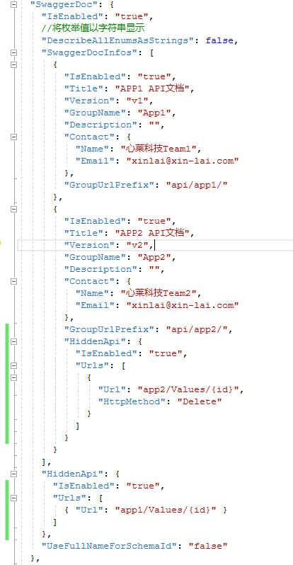
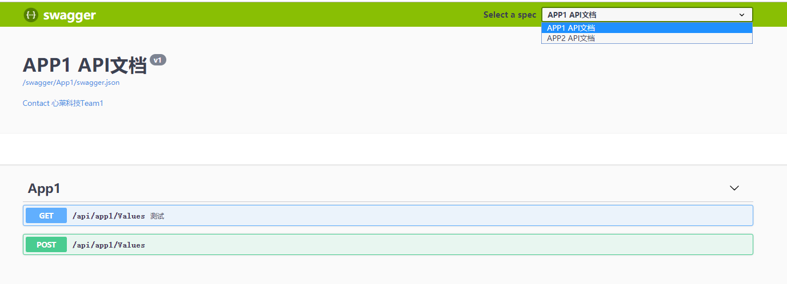
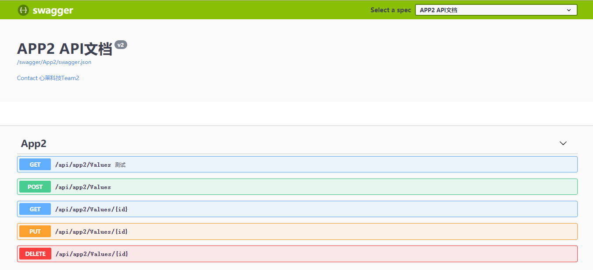

# Magicodes.SwaggerUI
快速配置和集成SwaggerUI

## 特点
- 通过配置文件简单配置即可完成SwaggerUI的API格式JSON生成和集成

- 支持API分组和隐藏


- 支持自定义页面和验证

## Nuget包

| 名称     |      Nuget      |
|----------|:-------------:|
| Magicodes.SwaggerUI  |  [](https://www.nuget.org/packages/Magicodes.SwaggerUI) |

## 联系我们

> #### 订阅号

关注“麦扣聊技术”微信订阅号可以获得最新文章、教程、文档。


> #### QQ群

- 编程交流群<85318032>

- 产品交流群<897857351>

> #### 文档官网&官方博客

- 文档官网：<https://docs.xin-lai.com/>
- 博客：<http://www.cnblogs.com/codelove/>


> #### 其他开源库

- <https://github.com/xin-lai>
- <https://gitee.com/magicodes>

## 更新日志

### 2019.10.21 

- 【Nuget】Magicodes.SwaggerUI  2.0.1
- 【升级】单个文档不分组，显示所有API
- 【梳理】梳理目录结构

### 2019.10.19
- 【升级】支持API分组，支持非侵入式配置，无需修改代码，仅通过配置即可完成API分组（见下面示例）
- 【重构】重构整体逻辑

## Demo
### 配置Demo
```
  "SwaggerDoc": {
    "IsEnabled": "true",
    //将枚举值以字符串显示
    "DescribeAllEnumsAsStrings": false,
    "SwaggerDocInfos": [
      {
        "IsEnabled": "true",
        "Title": "APP1 API文档",
        "Version": "v1",
        "GroupName": "App1",
        "Description": "",
        "Contact": {
          "Name": "心莱科技Team1",
          "Email": "xinlai@xin-lai.com"
        },
        "GroupUrlPrefix": "api/app1/"
      },
      {
        "IsEnabled": "true",
        "Title": "APP2 API文档",
        "Version": "v2",
        "GroupName": "App2",
        "Description": "",
        "Contact": {
          "Name": "心莱科技Team2",
          "Email": "xinlai@xin-lai.com"
        },
        "GroupUrlPrefix": "api/app2/"
      }
    ],
    "HiddenApi": {
      "IsEnabled": "true",
      "HiddenUrls": "app1/Values/{id}"
    },
    "UseFullNameForSchemaId": "false"
  }
```

### 注入代码:

```
//添加自定义API文档生成(支持文档配置)
public IServiceProvider ConfigureServices(IServiceCollection services)
{
services.AddCustomSwaggerGen(_appConfiguration);
}

public void Configure(IApplicationBuilder app, ILoggerFactory loggerFactory)
{
//启用自定义API文档(支持文档配置)
app.UseCustomSwaggerUI(_appConfiguration);
}
```